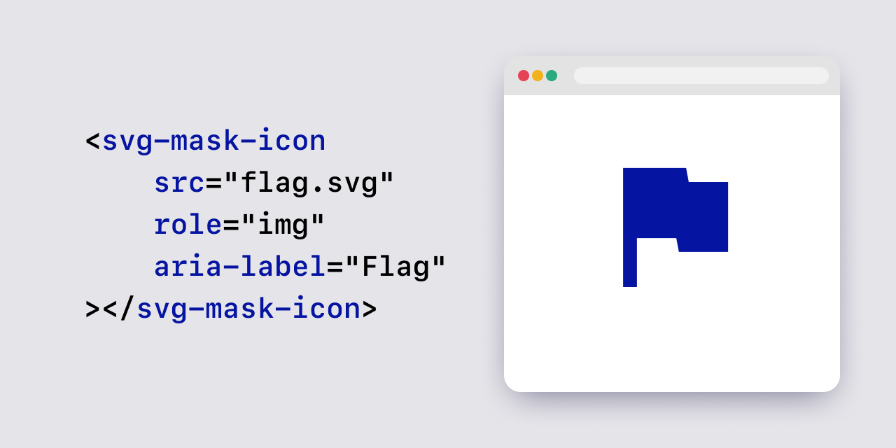

# svg-mask-icon

[English](README.md) | 日本語



[CSS mask-image](https://developer.mozilla.org/docs/Web/CSS/mask-image) を使用した非常にシンプルな**Web Components**です。CSSを使用してローカルの.svgファイルの色を指定でき、アイコンフォントと同様に使用できます。

<br />

## 目次
* [デモ](#デモ)
* [比較表](#比較表)
* [インストール](#インストール)
* [使い方](#使い方)

<br />

## デモ
[サンプルページ](https://psephopaiktes.github.io/svg-mask-icon/)

<br />

## 比較表

 \ | &lt;svg-mask-icon&gt; | &lt;img&gt; | アイコンフォント | &lt;svg&gt; | SVGスプライト 
--:|:--:|:--:|:--:|:--:|:--:
 **CSS色指定**         | ✅ | - | ✅ | ✅ | ✅ 
 **`.svg`ファイルの使用** | ✅ | ✅ | - | - | -
 **ビルドプロセス不要**  | ✅ | ✅ | - | ✅ | -
 **シンプルなHTML**       | ✅ | ✅ | ✅ | - | -
 **ブラウザ翻訳対応** | ✅ | ✅ | - | ✅ | ✅
 **アクセシビリティ**        | ✅ | ✅ | ✅ | - | -

### &lt;img src="icon.svg" /&gt;
`img`タグを使用してSVGファイルを読み込む場合、CSSで色を変更することはできません。

### アイコンフォント
[Material Symbol](https://fonts.google.com/icons) や [Font Awesome](https://fontawesome.com/) のようなフォントデータを使用する場合です。画像からのフォント生成プロセスが複雑です。ブラウザで翻訳機能を使用する際に表示の問題が発生します。

### &lt;svg&gt;...&lt;/svg&gt;
`svg`タグを直接記述する方法です。HTMLが複雑になり、不便です。また、`.svg`ファイルの形式で管理することはできません。

### SVGスプライト
SVGスプライトを作成し、`<use>`を使用して指定する方法です。ビルドプロセスが複雑で、`aria-label`のようなアクセシビリティ機能を扱うのが難しいです。

<br />

## インストール
```bash
npm i svg-mask-icon
```

```js
import "svg-mask-icon";
```

### または

1. [./dist-cdn/svg-mask-icon.js](./dist-cdn/svg-mask-icon.js) をダウンロードします。
2. HTMLにスクリプトを読み込みます。
```html
<script type="module" src="svg-mask-icon.js"></script>
```

<br />

## 使い方

### 基本:
```html
<svg-mask-icon src="icon.svg" />
```

### altテキスト付きの画像として使用する場合:
```html
<svg-mask-icon
    src="icon.svg"
    aria-label="テキストラベル"
></svg-mask-icon>
```
または
```html
<svg-mask-icon
    src="icon.svg"
>テキストラベル（表示されません）</svg-mask-icon>
```

### 装飾画像として使用する場合:
```html
<svg-mask-icon
    src="icon.svg"
    role="presentation"
    aria-hidden="true"
></svg-mask-icon>
```
